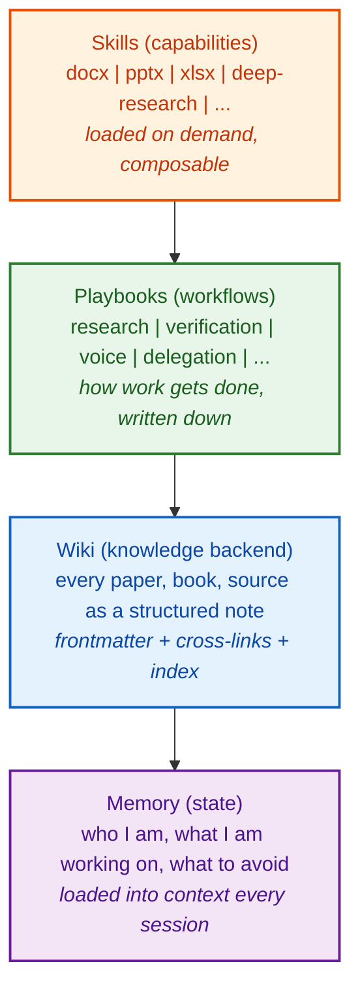
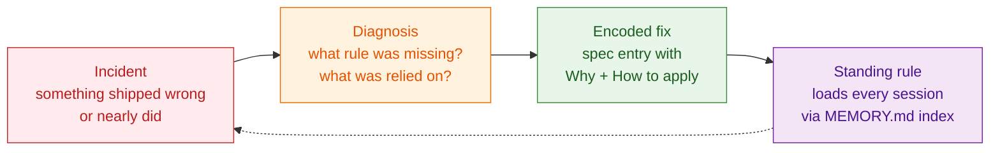

# Architecture

Four layers, each doing one job. The layers compose. None of them depend on a specific model or vendor.

## The four layers

## Layer 1: Memory

A typed, frontmatter-tagged state layer that persists across every conversation. Four types: `user` (who I am), `feedback` (how to work with me), `project` (what is in flight), `reference` (where to look). Each memory is a single MD file. A thin index file (`MEMORY.md`) is loaded into every new conversation as a list of one-line pointers. Deep content is lazy-loaded by reference.

The index trick is the whole game. The full memory corpus is too big to live in context. The index is small enough that it always fits, and rich enough that the assistant knows where to look.

See `memory/schema.md` for the full spec.

## Layer 2: Wiki

The knowledge backend. Every paper I read, every book I work through, every primary source gets a structured note. Notes have frontmatter (author, year, topic tags, source tier), a summary, key claims, and `[[wikilinks]]` to related notes. An `INDEX.md` per topic area collects pointers.

This is institutional memory. Not a notes folder. A future collaborator could read it and onboard.

See `wiki/schema.md`.

## Layer 3: Playbooks

Every workflow has a written rulebook. How a paper goes from PDF to wiki entry. How a factual claim gets verified before it ships. How drafts get reviewed. What gets delegated back to the human. Playbooks live in `workflows/` and are version-controlled like code.

When a workflow fails, the fix is a new playbook entry or a new memory rule. Failures do not regress.

## Layer 4: Skills

Specialist capabilities loaded on demand. Document creation (docx, pptx, xlsx, pdf). Deep research (multi-source fan-out with adversarial verification). Skill authoring (skills that create other skills). Same knowledge base, different output surfaces.

## End-to-end process flow

How a single PDF becomes durable knowledge and ships as output.

```mermaid
flowchart LR
    classDef src fill:#E1F5FE,stroke:#0277BD,color:#01579B
    classDef ing fill:#FFF3E0,stroke:#EF6C00,color:#E65100
    classDef sto fill:#F3E5F5,stroke:#7B1FA2,color:#4A148C
    classDef draft fill:#E8F5E9,stroke:#388E3C,color:#1B5E20
    classDef check fill:#FFEBEE,stroke:#C62828,color:#B71C1C
    classDef human fill:#FFFDE7,stroke:#F9A825,color:#F57F17
    classDef out fill:#EDE7F6,stroke:#4527A0,color:#311B92

    SRC["PDF / Book chapter<br/>Web source / Primary doc"]:::src

    SRC --> ID["1. Identity check<br/>title, authors, year, edition"]:::ing
    ID --> READ["2. Three-pass read<br/>skeleton → targeted → detail"]:::ing
    READ --> NOTE["3. Three-layer note<br/>takeaway / claims / full"]:::ing
    NOTE --> WIKI["Wiki entry<br/>frontmatter + cross-links"]:::sto

    WIKI --> IDX["Topic index updated"]:::sto
    WIKI --> MEM["Memory updated<br/>if fact-pack changes"]:::sto

    WIKI --> PULL["Drafting pulls layers<br/>(takeaway / claims / full)"]:::draft
    MEM --> PULL
    PERSONA["Persona spec"]:::sto --> PULL
    STYLE["Style bible"]:::sto --> PULL

    PULL --> DRAFT["Draft produced"]:::draft
    DRAFT --> VOICE["Voice rules check<br/>punctuation / phrases / structure"]:::check
    VOICE --> VERIFY["Verification gate<br/>number / attribution / scope / interpretation"]:::check
    VERIFY --> APPROVE{"Human approval"}:::human

    APPROVE -- approved --> SHIP["Articles · Reports<br/>Decks · Briefings"]:::out
    APPROVE -- rejected --> FIX["Diagnosis<br/>What rule was missing?"]:::human
    FIX --> RULE["New spec entry<br/>memory or playbook"]:::sto
    RULE -.-> MEM

    SHIP --> LOG["Result logged<br/>activity + outcome"]:::sto
    LOG -.-> MEM
```

## Failure-recovery loop

Every standing rule in the system traces to a specific incident. Failures get encoded so they do not recur.

The dashed return arrow says: the rule is in place before the same incident can happen again. The loop closes.

## Cross-cutting choices

### Markdown everywhere

Every layer uses plain Markdown files. Not a database. Not a vector store. Not a SaaS notes app.

Why:

- Diffable in git. I can see what changed.
- Greppable in one command.
- LLM-native. No parser, no schema validator, no SDK.
- Portable. The same files work in any editor, any tool, any future model.
- Self-documenting via YAML frontmatter.
- Composable via `[[wikilinks]]`.
- No vendor lock-in. If I swap models tomorrow, the files still work.

Markdown is a hedge against tool churn. Most knowledge systems get rebuilt every two years because their substrate dies. This one will not.

### Context-window economics

The wiki is several gigabytes. It cannot live in the assistant's context. The architecture is shaped by that constraint.

Solution: a thin index (`MEMORY.md`) loads every session and points to deep content. The assistant reads only what it needs, when it needs it. This is the difference between a system that scales and one that does not.

### Spec-driven, not chat-driven

Every behavior is written down before it runs. `agent/instructions.md` is a spec. `agent/persona.template.md` is a spec. `agent/voice-rules.md` is a spec. Every standing rule in memory has a `Why:` line and a `How to apply:` line.

This is the same discipline you would use to spec a feature at work. Plain English, version-controlled, reviewable. The assistant follows the spec. When the spec is wrong, you edit the spec.

### Two-way fact-checking

The assistant verifies load-bearing facts before drafting, not after. The human verifies the assistant's recall against domain knowledge the assistant does not have. Both sides correct each other. See `workflows/verification.md`.

### Failure recovery as a system feature

Nearly every standing rule in `memory/` traces to a specific incident. The system encodes its own mistakes so they do not happen twice. See `workflows/failure-recovery.md`.
